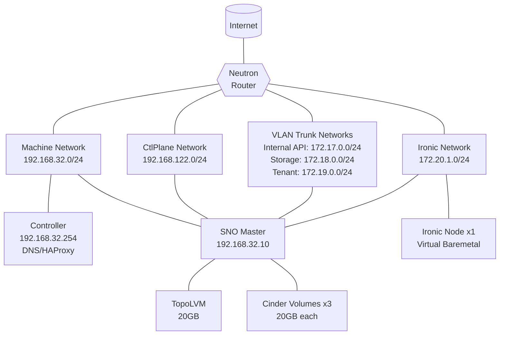

# sno-1-bm Scenario

## Overview

A Single Node OpenShift (SNO) scenario designed to test s2i-built OpenStack
container images with Ironic bare metal provisioning. Uses 1 dedicated Ironic
node with virtual-media boot interface. This scenario validates the OpenStack
bare metal lifecycle including node enrollment, provisioning, and Tempest
testing.

Container images are built by the `s2i-openstack-container-content-provider`
job and injected via `OpenStackVersion.spec.customContainerImages` before
the control plane is deployed.

## Architecture

<!-- markdownlint-disable MD013 -->

<!-- markdownlint-enable MD013 -->

### Component Details

- **Controller**: Hotstack controller providing DNS, load balancing, and
  orchestration services
- **SNO Master**: Single-node OpenShift cluster running the complete OpenStack
  control plane with s2i-built container images
- **Ironic Node**: 1 virtual bare metal node for testing Ironic provisioning workflows

## Networks

- **machine-net**: 192.168.32.0/24 (OpenShift cluster network)
- **ctlplane-net**: 192.168.122.0/24 (OpenStack control plane)
- **internal-api-net**: 172.17.0.0/24 (OpenStack internal services)
- **storage-net**: 172.18.0.0/24 (Storage backend communication)
- **tenant-net**: 172.19.0.0/24 (Tenant network traffic)
- **ironic-net**: 172.20.1.0/24 (Bare metal provisioning network)

## OpenStack Services

This scenario deploys a comprehensive OpenStack environment:

### Core Services

- **Keystone**: Identity service with LoadBalancer on Internal API
- **Nova**: Compute service with Ironic driver for bare metal
- **Neutron**: Networking service with OVN backend
- **Glance**: Image service with Swift backend
- **Swift**: Object storage service
- **Placement**: Resource placement service

### Bare Metal Services

- **Ironic**: Bare metal provisioning service
- **Ironic Inspector**: Hardware inspection service
- **Ironic Neutron Agent**: Network management for bare metal

## Ironic Boot Interface

The virtual Ironic node uses `redfish-virtual-media` boot via sushy-tools
rescue mode.

## s2i Content Provider Integration

The `s2i-openstack-container-content-provider` Zuul job builds all s2i
container images and exposes them in a paused registry. This scenario:

1. Bridges `s2i_content_provider_registry_ip` to `content_provider_registry_ip`
   so hotstack's `pre-deploy.yml` configures the insecure registry on the OCP
   cluster.
2. Passes `s2i_content_provider_os_custom_container_images` as
   `customContainerImages` to the `OpenStackVersion` hotloop stage, which
   patches `spec.customContainerImages` before the control plane is deployed.

## Configuration Files

- `bootstrap_vars.yml`: Infrastructure and OpenShift configuration.
- `automation-vars.yml`: Hotloop deployment stages (includes OpenStackVersion stage)
- `heat_template.yaml`: OpenStack infrastructure template (virtual-media boot)
- `manifests/openstack-version.yaml`: OpenStackVersion CR for custom container images
- `manifests/control-plane/control-plane.yaml.j2`: OpenStack service configuration
- `test-operator/automation-vars.yml`: Comprehensive test automation
- `test-operator/tempest-tests.yml`: Tempest test specifications
