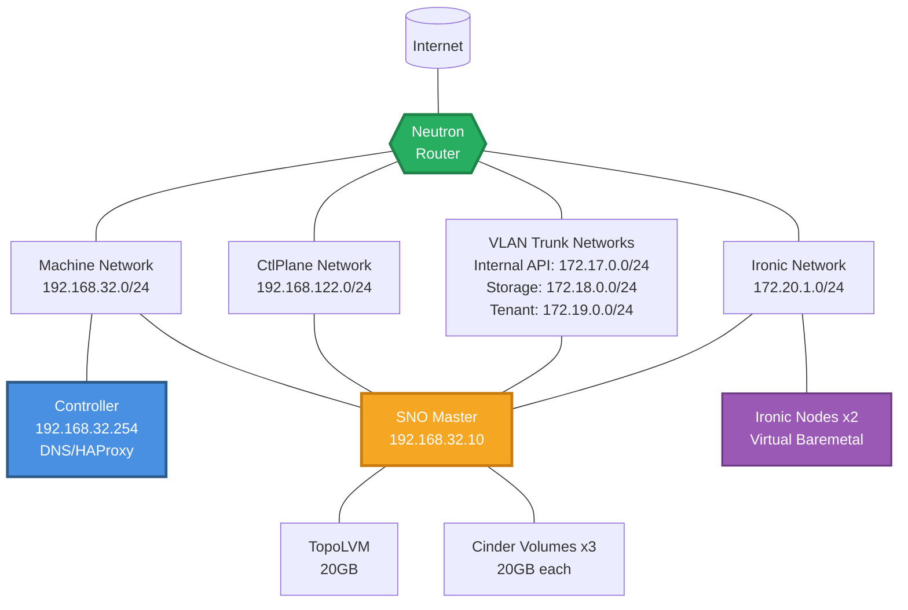

# sno-2-bm Scenario

## Overview

A Single Node OpenShift (SNO) scenario designed to test OpenStack Ironic bare
metal provisioning with 2 dedicated Ironic nodes using mixed boot interfaces.
This scenario validates the complete OpenStack bare metal lifecycle including
node enrollment, provisioning, and comprehensive Tempest testing with both
virtual media and iPXE network boot methods.

## Architecture

<!-- markdownlint-disable MD013 -->

<!-- markdownlint-enable MD013 -->

### Component Details

- **Controller**: Hotstack controller providing DNS, load balancing, and
  orchestration services
- **SNO Master**: Single-node OpenShift cluster running the complete OpenStack
  control plane
- **Ironic Nodes**: 2 virtual bare metal nodes for testing Ironic provisioning workflows

## Networks

- **machine-net**: 192.168.32.0/24 (OpenShift cluster network)
- **ctlplane-net**: 192.168.122.0/24 (OpenStack control plane)
- **internal-api-net**: 172.17.0.0/24 (OpenStack internal services)
- **storage-net**: 172.18.0.0/24 (Storage backend communication)
- **tenant-net**: 172.19.0.0/24 (Tenant network traffic)
- **ironic-net**: 172.20.1.0/24 (Bare metal provisioning network)

## OpenStack Services

This scenario deploys a comprehensive OpenStack environment:

### Core Services

- **Keystone**: Identity service with LoadBalancer on Internal API
- **Nova**: Compute service with Ironic driver for bare metal
- **Neutron**: Networking service with OVN backend
- **Glance**: Image service with Swift backend
- **Swift**: Object storage service
- **Placement**: Resource placement service

### Bare Metal Services

- **Ironic**: Bare metal provisioning service
- **Ironic Inspector**: Hardware inspection service
- **Ironic Neutron Agent**: Network management for bare metal

## Ironic Boot Interface

Two boot interface modes are tested with the virtual Ironic nodes:

- **`redfish-virtual-media`**: Virtual media boot via sushy-tools rescue mode (ironic0)
- **`ipxe`**: iPXE network boot via sushy-tools rescue mode (ironic1)

The mixed boot interface configuration validates both boot methods in a single deployment,
ensuring compatibility and proper operation of different provisioning workflows.

## Usage

```bash
# Deploy the scenario
ansible-playbook -i inventory.yml bootstrap.yml \
  -e @scenarios/sno-2-bm/bootstrap_vars.yml \
  -e @~/cloud-secrets.yaml

# Run comprehensive tests
ansible-playbook -i inventory.yml 06-test-operator.yml \
  -e @scenarios/sno-2-bm/bootstrap_vars.yml \
  -e @~/cloud-secrets.yaml
```

## Configuration Files

- `bootstrap_vars.yml`: Infrastructure and OpenShift configuration.
- `automation-vars.yml`: Hotloop deployment stages
- `heat_template.yaml`: OpenStack infrastructure template (mixed boot interfaces)
- `manifests/control-plane/control-plane.yaml`: OpenStack service configuration
- `test-operator/automation-vars.yml`: Comprehensive test automation
- `test-operator/tempest-tests.yml`: Tempest test specifications

This scenario provides a complete environment for validating OpenStack bare
metal provisioning capabilities with mixed boot interfaces in a single-node
OpenShift deployment with comprehensive testing automation.
